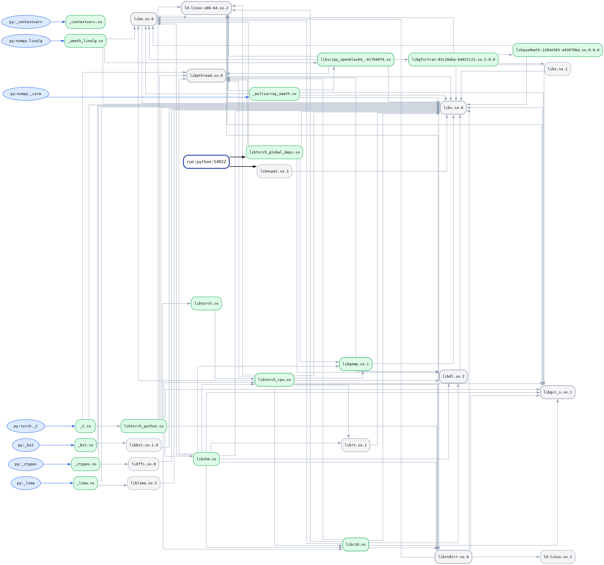

# tracso

Trace shared-object origins of a running process.

tracso reads /proc/<pid>/maps, walks the ELF DT_NEEDED graph of every
shared library the process has loaded, and produces a report mapping
each library back to the module or package that caused it to be loaded.

Supported runtimes: Python 3.8 and later.

## Example
This is the output of running this which gives a summary.
```bash
python -m tracso --run /root/virtual/python -c "import torch; import torch.nn as nn; import torch.nn.functional as F; import requests; import flask; import jupyter"
```
**tracso · run:python:50506 (python) · 31 libs · 478.0 MB**

**Notable**
  * libscipy_openblas64_-017048f4.so is loaded directly by 2 py: packages (py:numpy._core, py:numpy.linalg)
  * py:torch._C owns 91% of the total footprint (435.8 MB)
  * libtorch_cpu.so alone is 407.3 MB (85% of the total)

**Heaviest packages**
  py:torch._C                       435.8 MB  ███████████████░   91.2%  (16 libs)
  py:numpy._core                     25.9 MB  █░░░░░░░░░░░░░░░    5.4%  (12 libs)
  py:numpy.linalg                    14.5 MB  ░░░░░░░░░░░░░░░░    3.0%  (10 libs)
  py:_lzma                          599.4 KB  ░░░░░░░░░░░░░░░░    0.1%  (4 libs)
  py:_ctypes                        574.8 KB  ░░░░░░░░░░░░░░░░    0.1%  (4 libs)
  py:_bz2                           473.5 KB  ░░░░░░░░░░░░░░░░    0.1%  (4 libs)
  py:_contextvars                    14.0 KB  ░░░░░░░░░░░░░░░░    0.0%  (1 libs)
  (unattributed / system)           202.2 KB  ░░░░░░░░░░░░░░░░    0.0%  (2 libs)

**Most depended-on libraries**
  libc.so.6                                   1.9 MB  ████████████████  in=26   6 py
  libm.so.6                                 978.2 KB  ██████░░░░░░░░░░  in=10   3 py
  ld-linux-x86-64.so.2                      224.8 KB  ██████░░░░░░░░░░  in=9    6 py
  libpthread.so.0                            14.1 KB  █████░░░░░░░░░░░  in=8    3 py
  libgcc_s.so.1                             178.6 KB  ████░░░░░░░░░░░░  in=7    3 py
  libstdc++.so.6                              2.7 MB  ███░░░░░░░░░░░░░  in=5    2 py
  libdl.so.2                                 14.1 KB  ███░░░░░░░░░░░░░  in=5    1 py
  libtorch_cpu.so                           407.3 MB  ██░░░░░░░░░░░░░░  in=3    1 py
  libc10.so                                   1.2 MB  ██░░░░░░░░░░░░░░  in=3    1 py
  libgomp.so.1                              247.9 KB  ██░░░░░░░░░░░░░░  in=3    1 py
  libscipy_openblas64_-017048f4.so           24.0 MB  █░░░░░░░░░░░░░░░  in=2    2 py
  librt.so.1                                 14.2 KB  █░░░░░░░░░░░░░░░  in=2    1 py
  libtorch_python.so                         24.8 MB  █░░░░░░░░░░░░░░░  in=1    1 py
  _multiarray_umath.so                       10.2 MB  █░░░░░░░░░░░░░░░  in=1    1 py
  libgfortran-83c28eba-b4027c22.so.5.0.0      2.7 MB  █░░░░░░░░░░░░░░░  in=1    2 py

_Try: tracso --why <lib>  ·  tracso --tree  ·  tracso --json | jq_

Here is the image created by the same command but with `-o ./so_trace.png` before the `--run` option


## Usage
```
tracso [-h] [-o OUTPUT] [--run ...] [--why SONAME] [--pick] [--pick-py] [--pick-mode {textual,curses,plain}] [--tree] [--json] [--csv]
              [--depth DEPTH] [--name-depth N] [--color {auto,always,never}] [-v] [--version]
              [target]

positional arguments:
  target                PID or library path

options:
  -h, --help            show this help message and exit_
  -o, --output OUTPUT   output dot graph_
  --run ...             run command and trace it_
  --why SONAME          trace origin of a library
  --pick                interactively pick a process to trace
  --pick-py             Pick only python processes
  --pick-mode {textual,curses,plain} force a picker backend
  --tree                tree output
  --json                JSON output
  --csv                 CSV output
  --depth DEPTH         max .so depth (default 8)
  --name-depth N        python module name depth; 0=full (default 2)
  --color {auto,always,never}
  -v, --verbose         log injection decisions to stderr
  --version             show program's version number and exit
```

## Requirements
- Linux
- Python 3.8 or later
- readelf              (binutils, present on all Linux systems)
- ldconfig             (glibc)
- gdb                  (optional, enables Python module attribution)

No Python packages are required bessides stdlib. Optional dependencies:
- textual>=0.40  for interactive process picker
- loguru>=0.7    for structured logging


## Installation
```bash
git clone --depth 1 https://github.com/lof310/tracso
cd tracso
pip install .
```

## Output
The default output is a report with four sections:

Notable
    Up to four observations derived from the graph. Examples: a library
    loaded directly by more than one source module; a package whose
    transitive footprint exceeds 30% of the total; orphan libraries with
    no source and no parent.

Heaviest packages
    Source modules ranked by total bytes of reachable shared libraries.
    Each row shows the package name, aggregate size, a bar scaled to the
    total, the percentage of total bytes, and the number of libraries
    attributed to the package.

Most depended-on libraries
    Shared libraries ranked by in-degree, then by size. Each row shows
    the library name, size, a bar scaled to the maximum in-degree in the
    table, the in-degree, and the number of source modules that load it.

Orphans
    Shared libraries with no source origin and no shared-library parent.
    These are libraries loaded at runtime by a mechanism the tracer
    cannot see (dlopen from C code, for example) or libraries whose
    loader has already exited.

## How it works

1. Read /proc/<pid>/maps to obtain the set of shared objects currently
   mapped by the process.

2. For each shared object, run `readelf -d` to extract its DT_NEEDED,
   DT_SONAME, DT_RPATH, and DT_RUNPATH entries. Resolve each DT_NEEDED
   entry to an absolute path using, in order: the parent's DT_RUNPATH
   with $ORIGIN expanded, the parent's DT_RPATH with $ORIGIN expanded,
   then the ldconfig cache. Recurse.

3. If the process is a Python interpreter, attach with gdb, acquire the
   GIL via PyGILState_Ensure, execute a script that serialises
   sys.modules to JSON, release the GIL, detach. This yields the
   mapping from Python module name to file path.

4. Join the two graphs: Python module -> shared object from step 3,
   shared object -> shared object from step 2. Shared objects that have
   no Python parent are attributed to the nearest shared-object ancestor
   that does.

5. Render according to the requested format.

## Attribution model

A shared object is attributed to its nearest source module. If a shared
object is loaded by two source modules (for example, libssl.so.3 loaded
by both _ssl and _hashlib), its size is divided equally between them for
the purpose of the "Heaviest packages" table. Transitive imports through
Python are not attributed: if module A imports module B and B owns a
shared object, that shared object is attributed to B, not to A.


## Limitations

Linux only. Uses /proc, readelf, and ldconfig.

Requires gdb for accurate Python attribution. Without gdb, or when gdb
is unavailable for the target, tracso falls back to deriving package
names from the shared object's filesystem path (site-packages,
dist-packages, lib/python, .egg). The fallback misses standard library
extension modules and extensions installed outside those directories.

Statically linked binaries and musl-linked Python have no shared-object
files to walk. tracso reports what it can see and stops.

## Development
```bash
git clone https://github.com/lof310/tracso
cd tracso
pip install -r requirements-dev.txt
```

Formatting
```bash
black ./tracso
isort ./tracso
```

## License

MIT. See [LICENSE](LICENSE.md).
